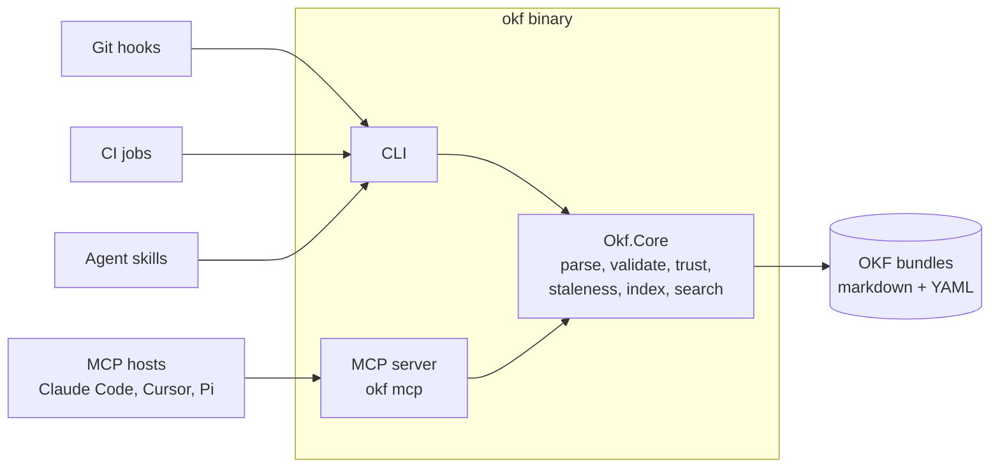

# okf-net

A .NET toolset for the [Open Knowledge Format (OKF) v0.2](https://github.com/GoogleCloudPlatform/knowledge-catalog/blob/main/okf/SPEC.md)
— portable, human- and agent-friendly knowledge bundles built from plain
markdown and YAML frontmatter.

## What is OKF?

OKF is Google's open, vendor-neutral format for representing knowledge: a
directory of markdown files with YAML frontmatter, organized however the
*domain* demands. Document kind lives in frontmatter (`type`), provenance in
`sources`, trust in `generated`/`verified`, freshness in `stale_after` — so a
knowledge corpus that agents continuously write stays readable, diffable,
portable, and trustable. If you can `cat` a file, you can read OKF; if you can
`git clone`, you can ship it.

okf-net is an independent implementation of tooling *around* that format —
in the spirit of the format's promise that anyone can produce and anyone can
consume.

## What okf-net provides

- **`okf` CLI** — a single self-contained binary (no runtime to install):
  - `okf lint` — conformance checking with a Roslyn-style severity model:
    only spec violations block by default; every other diagnostic is a
    warning you can promote (up to `treatAllWarningsAsErrors`)
  - `okf index` — deterministic `index.md` generation for progressive
    disclosure
  - `okf search` — search across your project bundle and any registered
    bundles
  - `okf inbox` / `okf verify` — review-and-acknowledge flow for
    agent-written changes, built on OKF's own `generated`/`verified` trust
    fields
  - `okf mcp` — the same capabilities as an MCP server for agent hosts
    (Claude Code, Cursor, and friends)
- **Layered vaults** — a personal knowledge vault at `~/okf/` plus
  per-project bundles, joined through an explicit opt-in registry; search
  behavior is deterministic for teams by default
- **Custodian pattern** — skills and conventions for the agent that
  maintains a bundle (capture, enrichment, staleness refresh), designed to
  run from git hooks and CI
- **Guardrails** — immutable `references/` evidence capture, provenance
  citation discipline, and honest trust tiers (unverified →
  machine-confirmed → human-reviewed)

## Architecture

Everything lives in one core library; the CLI and MCP server are thin
adapters over it. Consumers never need more than the binary — or nothing at
all, since an OKF bundle is just markdown.



## Project layout convention

okf-net expects a project's knowledge to live under an `okf/` directory —
never at the repo root (an unfenced `README.md` inside a bundle root would
violate OKF conformance):

```text
<project>/okf/
  README.md          # repo-facing docs, outside any bundle root
  bundles/<name>/    # one or many OKF bundle roots
  custodian/         # skill + config for the maintaining agent (strippable)
```

## Status

**Design complete; MVP implementation in progress.** The architecture is
fully decided and documented, CI releases `rc` prereleases from `main`, and
the first code (Okf.Core) is next. Nothing is usable yet — watch the
releases.

## Documentation

- [Architecture decisions](docs/decisions.md) — the running decision log
  (the "why" behind everything above)
- [Product requirements](docs/prd.md) — the requirement-shaped "what",
  with numbered, testable requirements
- [OKF v0.2 specification](https://github.com/GoogleCloudPlatform/knowledge-catalog/blob/main/okf/SPEC.md)
  — the upstream format this toolset implements
- [AGENTS.md](AGENTS.md) — contributor and agent rules (Conventional
  Commits, hooks, lint)

## Contributing / developing

```bash
git clone ssh://git@gitlab.tychostation.dev:2222/ringo/okf-net.git
cd okf-net
mise run setup    # installs git hooks (conventional commits + markdown lint)
```

All commits (except merges) must follow
[Conventional Commits v1.0.0](https://www.conventionalcommits.org/en/v1.0.0/).

## License

[Apache 2.0](LICENSE). Portions derived from Google Cloud Platform's
[knowledge-catalog](https://github.com/GoogleCloudPlatform/knowledge-catalog)
project — see [NOTICE](NOTICE).
