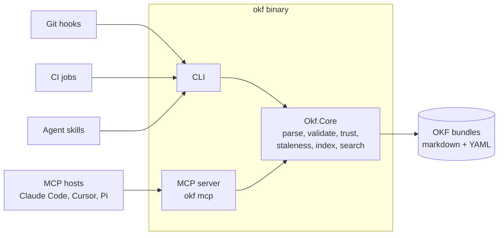

# okf-net

A .NET toolset for the [Open Knowledge Format (OKF) v0.2](https://github.com/GoogleCloudPlatform/knowledge-catalog/blob/main/okf/SPEC.md)
— portable, human- and agent-friendly knowledge bundles built from plain
markdown and YAML frontmatter.

okf-net is a trustworthy, portable implementation of the LLM Wiki pattern,
built on OKF — agents accumulate knowledge without humans surrendering
provenance, review, portability, or control.

## What is OKF?

OKF is Google's open, vendor-neutral format for representing knowledge: a
directory of markdown files with YAML frontmatter, organized however the
*domain* demands. Document kind lives in frontmatter (`type`), provenance in
`sources`, trust in `generated`/`verified`, freshness in `stale_after` — so a
knowledge corpus that agents continuously write stays readable, diffable,
portable, and trustable. If you can `cat` a file, you can read OKF; if you can
`git clone`, you can ship it.

okf-net is an independent implementation of tooling *around* that format —
in the spirit of the format's promise that anyone can produce and anyone can
consume.

## What okf-net provides

- **`okf` CLI** — a single self-contained binary (no runtime to install):
  - `okf lint` — conformance checking with a Roslyn-style severity model:
    only spec violations block by default; every other diagnostic is
    non-blocking unless you promote it
  - `okf index` — deterministic `index.md` generation for progressive
    disclosure
  - `okf search` — search your project bundle, ranked and links-first;
    `--scope registered` or `--scope all` widens it to the vaults you
    registered, and project-only stays the default so a query answers the
    same on every machine and in CI
  - `okf register` / `okf unregister` / `okf registry` — the explicit,
    idempotent registry of vaults and bundles that `--scope` reads; nothing
    is ever registered for you
  - `okf inbox` / `okf verify` — review-and-acknowledge flow for
    agent-written changes, built on OKF's own `generated`/`verified` trust
    fields
  - `okf capture` / `okf generated` — the bookkeeping a producer owes,
    written by code rather than by hand: `capture add` hashes an artifact
    dropped in `raw/` and records it, `capture close` marks it ingested, and
    `generated stamp` writes a concept's generation stamp. Each edits the file
    in place and refuses rather than repairs
  - `okf bundle` — package your bundles for consume-only distribution
    (tar.gz, zip, or a plain directory) with byte-reproducible archives and a
    manifest recording a `sha256` per file, which `--verify` re-checks
  - `okf site` — renders the vault as a self-contained static site: a trust
    dashboard whose tiles are clickable filters, a force-directed graph of
    cross-links coloured by trust tier, and one browsable page per concept.
    Hostable on GitLab Pages, openable straight from `file://`, and with
    `--single-file` reducible to one HTML file you can hand to someone
  - `okf skills` — the three agent skills ship inside the binary;
    `okf skills install` places them for Claude Code, pi, or any directory
    you name, and `okf skills path <skill>` says where one landed
  - `okf completion <bash|zsh|fish|pwsh>` — prints a completion script
    generated from okf's own verb table, so tab completion never lags the
    binary; the installers place it for you
  - `okf mcp` — the same read capabilities as an MCP server for agent hosts
    (Claude Code, Cursor, and friends)
- **Layered vaults** — a personal knowledge vault at `~/okf/` plus
  per-project bundles, joined through an explicit opt-in registry at
  `$XDG_CONFIG_HOME/okf/registry.json` (else `~/.config/okf/`); the personal
  vault is an ordinary entry in it, and search behavior is deterministic for
  teams by default
- **Custodian pattern** — skills and conventions for the agent that
  maintains a bundle (capture, enrichment, staleness refresh), designed to
  run from git hooks and CI
- **[Agent skills](skills/README.md)** — three host-neutral skills over the
  same doctrine: `okf-capture` gets knowledge in, `okf-custodian` keeps it
  alive, and `okf-vault` gets it back out for an agent answering a question.
  They ship inside the binary and the installers place them for you
- **Guardrails** — hashed, immutable-after-ingestion evidence in `raw/`,
  provenance citation discipline, and honest trust tiers (unverified →
  machine-confirmed → human-reviewed)

## Install

Two channels, one pipeline. `dev` ships **release candidates**: every merge
there cuts a `vX.Y.Z-rc.N` tag. `main` ships **stable versions**: it is
advanced by an explicit promotion of `dev`, and that merge cuts a plain
`vX.Y.Z`. Either tag's pipeline publishes self-contained binaries for three
platforms to this project's generic package registry, by the same code path —
the version is read out of the tag, so a candidate and a release are built and
verified identically.

**Linux and macOS:**

```sh
curl -fsSL https://get.okf.tychostation.dev/install.sh | sh
```

**Windows** (PowerShell 5.1 or 7+):

```powershell
irm https://get.okf.tychostation.dev/install.ps1 | iex
```

Either one fetches the stable channel's manifest by default, verifies its binary's
`sha256` against it, and installs atomically — to `~/.local/bin/okf` on Linux
and macOS, to `%LOCALAPPDATA%\okf\bin\okf.exe` on Windows, where it also adds
that directory to your user `PATH`. Neither needs root or Administrator. Pin a
version, install somewhere else, or look before you leap:

```sh
curl -fsSL https://get.okf.tychostation.dev/dev/install.sh | sh -s -- --channel rc
curl -fsSL https://get.okf.tychostation.dev/install.sh | sh -s -- --version 1.0.0
curl -fsSL https://get.okf.tychostation.dev/install.sh | OKF_INSTALL_DIR=/usr/local/bin sh
curl -fsSL https://get.okf.tychostation.dev/install.sh | sh -s -- --dry-run
```

```powershell
# `iex` is handed a string, not a command, so arguments need the script-block form.
& ([scriptblock]::Create((irm https://get.okf.tychostation.dev/dev/install.ps1))) -Channel rc
& ([scriptblock]::Create((irm https://get.okf.tychostation.dev/install.ps1))) -Version 1.0.0
& ([scriptblock]::Create((irm https://get.okf.tychostation.dev/install.ps1))) -InstallDir C:\tools\okf
& ([scriptblock]::Create((irm https://get.okf.tychostation.dev/install.ps1))) -DryRun
```

The scripts are [`install.sh`](install.sh) and [`install.ps1`](install.ps1) in
this repository, and every release ships the copies it was cut with.

### Upgrading

Once okf is installed, it upgrades itself — no second `curl | sh`:

```sh
okf upgrade --check    # what you have vs what is published; exit 1 if newer exists
okf upgrade            # download, verify the sha256, replace the running binary
okf upgrade --dry-run  # say what it would do, write nothing
okf upgrade --channel rc      # follow release candidates from dev
okf upgrade --version 1.0.0   # pin a release; downgrades too
```

Stable reads `stable/latest.json`; `--channel rc` reads `dev/latest.json`. Both use the
same `OKF_INSTALL_URL` as the installers, while a version pin reads the shared immutable
`v<version>/latest.json`. The upgrader downloads beside the binary, checks its digest against the
manifest, and only then renames the file into place — so `okf` is either the old
binary or the new one, never a partial download. Nothing outside that one
directory is read or written, and a mismatch prints both digests and touches
nothing.

**This is the only okf command that uses a network, and it does so only when you
run it.** No other verb checks for updates, on startup or otherwise
([AD-53](docs/architecture.md)). `--check` is exit-code shaped — `0` current,
`1` an upgrade is available — so it fits in a prompt or a scheduled job without
parsing anything.

### The agent skills come with it

Once the binary is in place, both installers run `okf skills install`. Nothing
is downloaded for it: the three skills ship *inside* the binary, so this is a
set of file writes. It puts okf's own copy in `~/.local/share/okf/skills`
(`%LOCALAPPDATA%\okf\skills` on Windows) and, when your machine already has
them, into `~/.claude/skills` for Claude Code and `~/.pi/agent/skills` for pi.
A directory that does not exist is not created — okf does not install a host
you have not installed.

```sh
okf skills list                       # what this binary carries
okf skills path okf-capture           # where a skill landed
okf skills install --host claude      # one host, explicitly
okf skills install --scope project    # beside this project, not in your home
okf skills install --dir ./skills     # any other agent, or a vendored copy
```

A skill file you have edited is never overwritten: it is reported as
`skipped (modified)` and the run still exits 0, until you pass `--force`. To
skip the step entirely — if you manage your agent's skill directories
yourself — set `OKF_SKIP_SKILLS=1`:

```sh
curl -fsSL https://get.okf.tychostation.dev/install.sh | OKF_SKIP_SKILLS=1 sh
```

```powershell
$env:OKF_SKIP_SKILLS = '1'; irm https://get.okf.tychostation.dev/install.ps1 | iex
```

If the step fails, the install does not: it warns and names the command to run
again. Every release also carries `okf-skills.tar.gz` — the same three files,
for a host okf-net does not know about or a project that would rather vendor
them.

### Tab completion comes with it too

The installers also write the completion script for the shell `$SHELL` names —
bash, zsh or fish — and on Windows add one line to your PowerShell `$PROFILE`.
Nothing is downloaded for that either: `okf` prints its own completion script,
generated from the verb table it dispatches on, so it lists exactly the verbs
and options the binary you have actually has.

Load one into the shell you are in right now:

```sh
eval "$(okf completion bash)"
eval "$(okf completion zsh)"
okf completion fish | source
```

```powershell
okf completion pwsh | Out-String | Invoke-Expression
```

Or place it yourself, which is what the installer does:

```sh
okf completion bash > "${XDG_DATA_HOME:-$HOME/.local/share}/bash-completion/completions/okf"
okf completion zsh  > "${XDG_DATA_HOME:-$HOME/.local/share}/zsh/site-functions/_okf"
okf completion fish > "${XDG_CONFIG_HOME:-$HOME/.config}/fish/completions/okf.fish"
```

zsh reads that directory only when it is on `$fpath`, so if nothing completes,
put `fpath=(~/.local/share/zsh/site-functions $fpath)` in `~/.zshrc` above your
`compinit` line. Verbs, subcommands, options and the fixed values behind
`--format`, `--scope`, `--host` and friends all complete; so do skill names
after `okf skills path`. Nothing else asks okf a question — a completion never
resolves a vault or walks a bundle, because the tab key has to be instant.

To skip the step, set `OKF_SKIP_COMPLETIONS=1`:

```sh
curl -fsSL https://get.okf.tychostation.dev/install.sh | OKF_SKIP_COMPLETIONS=1 sh
```

```powershell
$env:OKF_SKIP_COMPLETIONS = '1'; irm https://get.okf.tychostation.dev/install.ps1 | iex
```

A completion that fails to land is a warning naming the command to run by hand,
never a failed install.

> **`get.okf.tychostation.dev` resolves only inside Ringo's network today.** The
> host is an internal nginx behind the internal Caddy; there is no public DNS
> record and no public route, so the one-liners above will not resolve for
> anyone else. Public availability — and the auth, rate limiting and
> **manifest signing** that have to come with it — is tracked in
> [#26](https://gitlab.tychostation.dev/ringo/okf-net/-/issues/26). The
> manifest is unsigned until then: the `sha256` check proves the bytes match
> the manifest, and nothing yet proves the manifest came from us.
>
> The publishing path is proven by the stable `v1.0.0` release and subsequent
> release candidates; successful tag pipelines publish all eight assets.

### What ships, and what it costs

Sizes are a `v1.1.0-rc.23` snapshot from 2026-08-17.

| Platform | Asset | Build | Size |
| --- | --- | --- | --- |
| Linux x86_64 | `okf-linux-x64` | NativeAOT | 11.1 MB |
| macOS Apple Silicon | `okf-osx-arm64` | trimmed self-contained | 17.3 MB |
| Windows x64 | `okf-win-x64.exe` | trimmed self-contained | 16.6 MB |

Beside the binaries each release carries `okf-net-knowledge.tar.gz` (this
repository's own knowledge bundle), `okf-skills.tar.gz` (the three agent
skills), `latest.json` and both installers — eight assets in all.

The difference is worth being plain about. NativeAOT compiles ahead of time to
a native image with no runtime inside it, and it compiles through the *host's*
toolchain — so it can only be produced on the platform it targets. The only CI
runner this project has is Linux, so `linux-x64` is AOT and the other two are
trim-safe self-contained: the IL is trimmed, then bundled with a .NET runtime
into a single file. They are larger and they start slower (JIT warm-up instead
of native code), and they are honest binaries otherwise — same source, same
version stamp, no runtime for you to install, no trim warnings on either.
Moving them to AOT needs a macOS and a Windows runner, which is post-1.0.

There is no Intel Mac (`osx-x64`), musl, or Linux arm64 build. Each is one more
runtime identifier in the same publish job, so if you need one, say so on
[#36](https://gitlab.tychostation.dev/ringo/okf-net/-/issues/36).

> **macOS: the binary is unsigned.** Gatekeeper refuses to run a downloaded
> binary that is neither code-signed nor notarised, and `curl` marks everything
> it downloads. `install.sh` clears that mark for you — the equivalent of
> `xattr -d com.apple.quarantine ~/.local/bin/okf`. If you download the asset by
> hand instead, run that yourself, or macOS refuses with "cannot be opened
> because the developer cannot be verified". Signing and notarisation need an
> Apple Developer account and are post-1.0.
>
> **Windows: `install.ps1` has never been run on Windows by CI.** There is no
> Windows runner in this pipeline. The script is static-analysed with
> PSScriptAnalyzer (`mise run lint-ps1`) and reviewed; its first real run is a
> tester's. If it breaks, that is a bug worth reporting rather than a surprise.

### From the package registry, by hand

The fallback, and what the installer does underneath. The download URL is
stable and predictable: the package version is the release tag without its
leading `v`. Take a version from the
[releases page](https://gitlab.tychostation.dev/ringo/okf-net/-/releases) —
once a release carries a binary, it links it directly — and:

```bash
# <version> is a release tag minus its leading `v`, e.g. 1.0.0 or 1.0.1-rc.2.
# <asset> is okf-linux-x64, okf-osx-arm64 or okf-win-x64.exe.
curl --fail --location --output okf \
  --header "PRIVATE-TOKEN: $GITLAB_TOKEN" \
  "https://gitlab.tychostation.dev/api/v4/projects/ringo%2Fokf-net/packages/generic/okf/<version>/<asset>"
chmod +x okf
xattr -d com.apple.quarantine okf   # macOS only; see the Gatekeeper note above
./okf version            # <version> — the tag, since a tagged build already names one
./okf version --verbose  # <version> then `commit: <sha>` — the commit it was built from
```

Each release also carries `latest.json` beside the binary, which is what makes
that release self-describing — a version, and per asset a relative path, a
size and a `sha256`. Fetch it the same way to check a download by hand.

The `PRIVATE-TOKEN` header is needed only because the project is private
today; it drops out if that changes. It is also the reason the one-liner exists
at all: the artifact host holds the read token so a consumer does not have to.

Two caveats worth stating plainly:

- **glibc, on Linux.** `okf-linux-x64` is compiled ahead of time against the
  Debian userland of the .NET SDK image, so it runs on that glibc version or
  newer. There is no musl build, and no Linux arm64 build.
- **No runtime to install.** That is the point (PRD CLI-17): consuming an OKF
  bundle must never require knowing the tool is written in C#. That holds for
  all three assets — the self-contained ones carry their runtime inside the
  single file rather than asking you for one.

## Architecture

Everything lives in one internal core library; `Okf.Core` is not a distributed
NuGet API. The CLI and MCP server are thin adapters over it. Consumers never
need more than the binary — or nothing at all, since an OKF bundle is just
markdown.



## Project layout convention

okf-net expects a project's knowledge to live under an `okf/` directory —
never at the repo root (an unfenced `README.md` inside a bundle root would
violate OKF conformance):

```text
<project>/okf/
  README.md          # repo-facing docs, outside any bundle root
  okf.json           # committed project configuration
  bundles/<name>/    # one or many OKF bundle roots
  custodian/         # skill + config for the maintaining agent (never distributed)
  raw/               # captured artifacts, outside every bundle root
```

`okf init` also writes two files at the project root, deliberately outside
`okf/`: a marker-fenced context-pointer block in `AGENTS.md` (created if
absent, spliced in place otherwise — never touching a byte outside the fence)
and a one-line `CLAUDE.md` pointing at it (written only when none exists). The
block tells an agent the project keeps its knowledge in a vault and names the
one trigger per skill — read, capture, maintain — that reaches it.
`--no-agents-md` skips both, a `--personal` vault never gets them (its parent
is the home directory, not a project), and `okf skills install --scope
project` writes the identical pair.

## Status

**1.0.0.** What is built and gated in CI:

- **`Okf.Core`** — the internal library layer for parse, validate, trust, staleness,
  index, search, bundle, and site. It is explicitly non-packable; no NuGet API is
  distributed.
- **Every CLI verb** — `okf init`, `lint`, `index`, `search`, `register`,
  `unregister`, `registry`, `inbox`, `verify`, `capture`, `generated`, `bundle`,
  `site`, `skills`, `completion`, `upgrade`, `mcp`, plus `help` and `version`.
- **The MCP server** — `okf mcp`, three read-only tools (`okf_list`,
  `okf_search`, `okf_read`) over stdio.
- **Three agent skills** — `okf-capture`, `okf-custodian`, `okf-vault`,
  embedded in the binary and installed by `okf skills install`; see
  [skills/README.md](skills/README.md).
- **This repo's own knowledge bundle**, linted and index-checked by the
  `dogfood` job on every push, and rendered to the Pages site below.

Not built: the Pi shim. It does not block 1.0.0. (The registry — `okf
register` / `okf unregister` / `okf registry` and `--scope` — was the other
entry here; it landed as the first 1.0.x item and is in the list above.)

Every merge to `dev` cuts an `rc` tag and every promotion to `main` cuts a
stable one, and that tag's pipeline publishes eight assets: three binaries —
`okf-linux-x64` (NativeAOT), `okf-osx-arm64` and `okf-win-x64.exe` (trim-safe
self-contained, because NativeAOT compiles through the host's toolchain and
the only runner here is Linux) — this repo's knowledge bundle as
`okf-net-knowledge.tar.gz`,
the agent skills as `okf-skills.tar.gz`, the `latest.json` release manifest,
and the two installers that read it:

```sh
curl -fsSL https://get.okf.tychostation.dev/install.sh | sh
```

```powershell
irm https://get.okf.tychostation.dev/install.ps1 | iex
```

Two caveats, both deliberate stopping points rather than oversights. The
artifact host **resolves only inside Ringo's network** — public exposure needs
auth, rate limiting and a signed manifest, tracked in
[#26](https://gitlab.tychostation.dev/ringo/okf-net/-/issues/26). The generated
knowledge site publishes from `main` to
[okf-net-28dd30.pages.tychostation.dev](https://okf-net-28dd30.pages.tychostation.dev),
which is on the same internal network and behind this project's access
control; `mise run site` renders the identical output locally, openable from
`file://`.

1.0.0 is the first stable version, cut from the whole history when `main`
became a release branch. The CLI surface and diagnostic identifiers are now
things that move by semver rather than by merge. `Okf.Core` remains an internal,
non-packable library layer rather than a distributed NuGet API; the #59 namespace
move and #13 dead-member removals are accepted because no external consumer or
library artifact exists. As of 2026-08-17, work on `dev` is published as
`v1.1.0-rc.N`; promotion still requires Ringo's explicit instruction.

## Documentation

- [Architecture spine](docs/architecture.md) — the invariants everything else
  is built from: numbered `AD` rules, the conventions, and the diagrams
- [Architecture decisions](docs/decisions.md) — the running decision log
  (the "why" behind everything above)
- [Product requirements](docs/prd.md) — the requirement-shaped "what",
  with numbered, testable requirements, each marked BUILT or deferred
- [Lessons learned](docs/lessons.md) — the non-obvious things this project
  learned the hard way, so nobody relearns them
- [Spikes](docs/spikes/) — dated investigations with their apparatus and
  their numbers, kept whatever the recommendation was
- [OKF v0.2 specification](https://github.com/GoogleCloudPlatform/knowledge-catalog/blob/main/okf/SPEC.md)
  — the upstream format this toolset implements
- [Agent skills](skills/README.md) — the three skills and when each fires
- [AGENTS.md](AGENTS.md) — contributor and agent rules (Conventional
  Commits, hooks, lint)

## Contributing / developing

```bash
git clone ssh://git@gitlab.tychostation.dev:2222/ringo/okf-net.git
cd okf-net
mise run setup    # installs git hooks (conventional commits + markdown lint)
```

All commits (except merges) must follow
[Conventional Commits v1.0.0](https://www.conventionalcommits.org/en/v1.0.0/),
and merge requests target **`dev`** — `main` is the stable release branch and
is only ever advanced by promoting `dev`.

## License

[Apache 2.0](LICENSE). Portions derived from Google Cloud Platform's
[knowledge-catalog](https://github.com/GoogleCloudPlatform/knowledge-catalog)
project — see [NOTICE](NOTICE).
