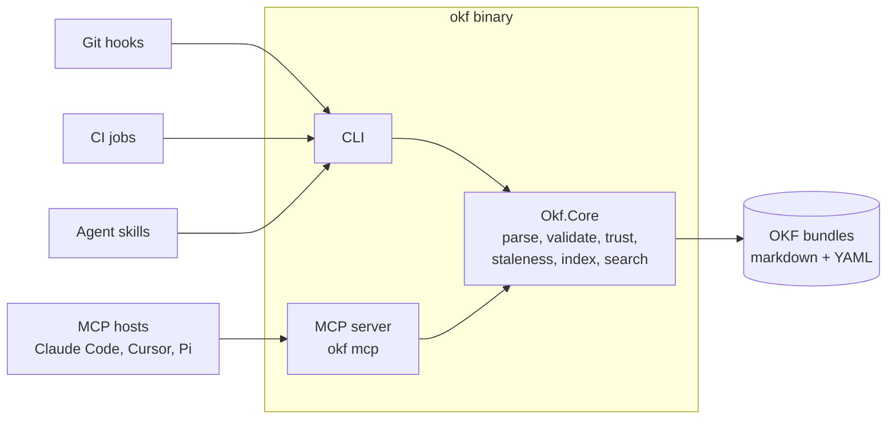

# okf-net

A .NET toolset for the [Open Knowledge Format (OKF) v0.2](https://github.com/GoogleCloudPlatform/knowledge-catalog/blob/main/okf/SPEC.md)
— portable, human- and agent-friendly knowledge bundles built from plain
markdown and YAML frontmatter.

## What is OKF?

OKF is Google's open, vendor-neutral format for representing knowledge: a
directory of markdown files with YAML frontmatter, organized however the
*domain* demands. Document kind lives in frontmatter (`type`), provenance in
`sources`, trust in `generated`/`verified`, freshness in `stale_after` — so a
knowledge corpus that agents continuously write stays readable, diffable,
portable, and trustable. If you can `cat` a file, you can read OKF; if you can
`git clone`, you can ship it.

okf-net is an independent implementation of tooling *around* that format —
in the spirit of the format's promise that anyone can produce and anyone can
consume.

## What okf-net provides

- **`okf` CLI** — a single self-contained binary (no runtime to install):
  - `okf lint` — conformance checking with a Roslyn-style severity model:
    only spec violations block by default; every other diagnostic is a
    warning you can promote (up to `treatAllWarningsAsErrors`)
  - `okf index` — deterministic `index.md` generation for progressive
    disclosure
  - `okf search` — search across your project bundle and any registered
    bundles
  - `okf inbox` / `okf verify` — review-and-acknowledge flow for
    agent-written changes, built on OKF's own `generated`/`verified` trust
    fields
  - `okf bundle` — package your bundles for consume-only distribution
    (tar.gz, zip, or a plain directory) with byte-reproducible archives and a
    manifest recording a `sha256` per file, which `--verify` re-checks
  - `okf mcp` — the same capabilities as an MCP server for agent hosts
    (Claude Code, Cursor, and friends)
- **Layered vaults** — a personal knowledge vault at `~/okf/` plus
  per-project bundles, joined through an explicit opt-in registry; search
  behavior is deterministic for teams by default
- **Custodian pattern** — skills and conventions for the agent that
  maintains a bundle (capture, enrichment, staleness refresh), designed to
  run from git hooks and CI
- **Guardrails** — immutable `references/` evidence capture, provenance
  citation discipline, and honest trust tiers (unverified →
  machine-confirmed → human-reviewed)

## Install (prerelease binaries)

`main` ships **release candidates**, not releases: every merge cuts a
`vX.Y.Z-rc.N` tag, and that tag's pipeline publishes a self-contained
`linux-x64` binary to this project's generic package registry. There is no
stable channel yet, and the `rc` is not decoration — the API, the CLI surface
and the diagnostic set can all still move.

> **No binary is downloadable yet.** The publishing job is new and has never
> run: nothing runs it but a tag pipeline, and no tag has been cut since it
> landed. Every release before that one carries no binary, and the job itself
> is unproven until the first tag exercises it. Until then, build from source:
> `mise run publish-aot` leaves the same binary in `artifacts/aot/okf`.

The download URL is stable and predictable: the package version is the release
tag without its leading `v`. Take a version from the
[releases page](https://gitlab.tychostation.dev/ringo/okf-net/-/releases) —
once a release carries a binary, it links it directly — and:

```bash
# <version> is a release tag minus its leading `v`, e.g. 1.0.0-rc.15.
curl --fail --location --output okf \
  --header "PRIVATE-TOKEN: $GITLAB_TOKEN" \
  "https://gitlab.tychostation.dev/api/v4/projects/ringo%2Fokf-net/packages/generic/okf/<version>/okf-linux-x64"
chmod +x okf
./okf version   # <version>+<short-sha> — the tag, and the commit it was built from
```

The `PRIVATE-TOKEN` header is needed only because the project is private
today; it drops out if that changes. A `curl | sh` installer that resolves the
newest rc for you does not exist yet — the stable URL scheme above is the half
of it that does.

Two caveats worth stating plainly:

- **linux-x64, glibc.** The binary is compiled ahead of time against the
  Debian userland of the .NET SDK image, so it runs on that glibc version or
  newer. There is no musl, arm64 or macOS build yet.
- **No runtime to install.** That is the point (PRD CLI-17): consuming an OKF
  bundle must never require knowing the tool is written in C#.

## Architecture

Everything lives in one core library; the CLI and MCP server are thin
adapters over it. Consumers never need more than the binary — or nothing at
all, since an OKF bundle is just markdown.



## Project layout convention

okf-net expects a project's knowledge to live under an `okf/` directory —
never at the repo root (an unfenced `README.md` inside a bundle root would
violate OKF conformance):

```text
<project>/okf/
  README.md          # repo-facing docs, outside any bundle root
  bundles/<name>/    # one or many OKF bundle roots
  custodian/         # skill + config for the maintaining agent (strippable)
```

## Status

**Prerelease.** `Okf.Core`, the CLI's `init`, `lint`, `index`, `search`,
`inbox`, `verify` and `bundle` commands, the MCP server and the agent skills
are built and gated in CI; the registry (`okf register`), the site generator
and the Pi shim are later milestones. Every merge to `main` cuts an `rc` tag,
and from the first tag cut after the publishing job landed that tag also ships
a runnable binary and this repo's own knowledge bundle — see
[Install](#install-prerelease-binaries), which says plainly that none exists
yet. Usable from source, deliberately not yet stable.

## Documentation

- [Architecture decisions](docs/decisions.md) — the running decision log
  (the "why" behind everything above)
- [Product requirements](docs/prd.md) — the requirement-shaped "what",
  with numbered, testable requirements
- [OKF v0.2 specification](https://github.com/GoogleCloudPlatform/knowledge-catalog/blob/main/okf/SPEC.md)
  — the upstream format this toolset implements
- [AGENTS.md](AGENTS.md) — contributor and agent rules (Conventional
  Commits, hooks, lint)

## Contributing / developing

```bash
git clone ssh://git@gitlab.tychostation.dev:2222/ringo/okf-net.git
cd okf-net
mise run setup    # installs git hooks (conventional commits + markdown lint)
```

All commits (except merges) must follow
[Conventional Commits v1.0.0](https://www.conventionalcommits.org/en/v1.0.0/).

## License

[Apache 2.0](LICENSE). Portions derived from Google Cloud Platform's
[knowledge-catalog](https://github.com/GoogleCloudPlatform/knowledge-catalog)
project — see [NOTICE](NOTICE).
