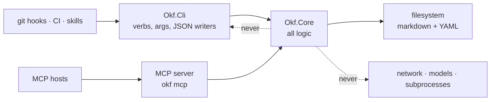
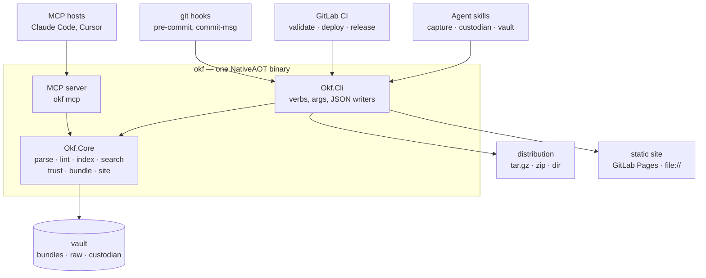
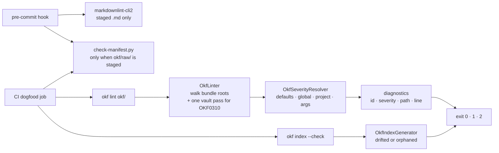
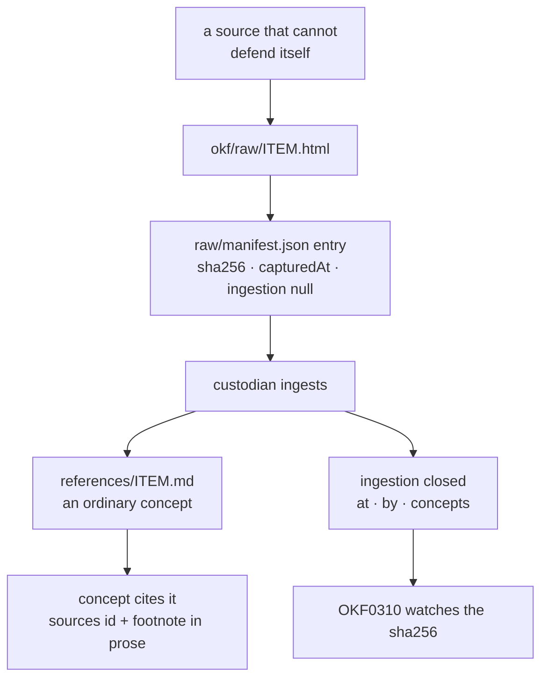
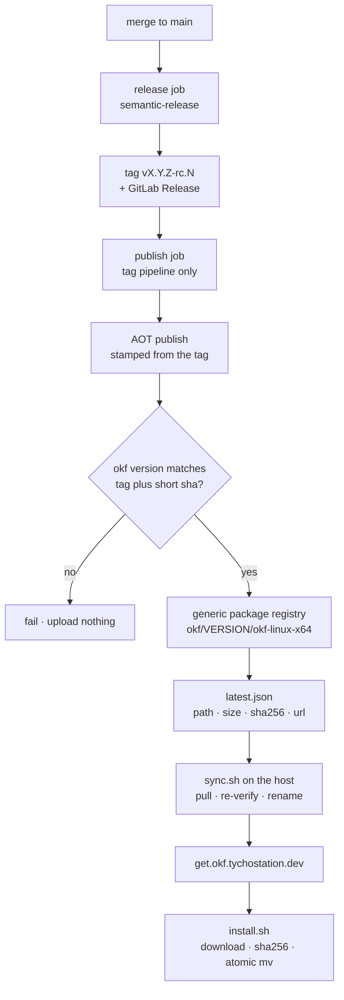
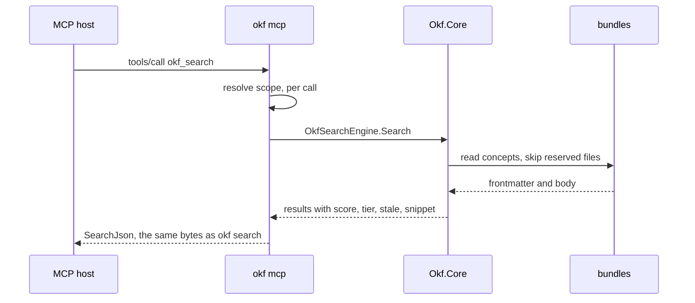
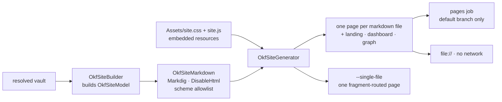

# okf-net — Architecture Spine

> **Status:** Architecture Spine, `v1.0.0-frozen`. The public API surface of `Okf.Core`
> was frozen by the [1.0.0 review](decisions.md#100-review-work-item-9-2026-08-15) on
> 2026-08-15; the two changes that review ordered landed in work item #30.
>
> **This document fixes invariants, not rationale.** Every rule below is distilled from
> [decisions.md](decisions.md), which stays the "why" log and wins wherever the two
> disagree. [prd.md](prd.md) stays the requirement-shaped "what". This spine is the
> consistency contract between them: the calls a future builder cannot read off compliant
> code.

## How this document is maintained

This section is written for the agent that will next update this file.

1. **Re-derive, never re-invent.** Read [decisions.md](decisions.md) and the code before
   editing an `AD`. *Done when* every claim you changed cites a decisions.md anchor or a
   file path that exists on `main`.
2. **Keep `AD` identifiers stable and append-only.** Amend an existing `AD`'s **Rule** in
   place when the decision was refined; add the next unused `AD-n` when the decision is
   new. *Done when* the identifiers still ascend with no gaps reused and no renumbering:
   `grep -oE '^### AD-[0-9]+' docs/architecture.md` prints a strictly increasing sequence.
3. **Strike a superseded `AD`; never delete one.** Wrap its heading in `~~` strikethrough,
   keep its **Binds** / **Prevents** / **Rule** lines intact for the record, and add a
   `**Superseded by:** AD-n` line. *Done when* the retired identifier is still present in
   the file and no later `AD` reuses it.
4. **Leave no placeholder.** No placeholder marker, no unfilled brace token, no unresolved
   cross-reference standing in for a rule. *Done when* this returns nothing outside fenced
   blocks:

   ```sh
   grep -nE '\bTBD\b|\bTODO\b|\bFIXME\b|similar to AD-[0-9]+' docs/architecture.md
   ```

5. **Every Stack row carries a version**, and every mermaid block parses. *Done when*
   `mise run lint` is clean and each fenced `mermaid` block renders.
6. **Regenerate the dogfood concept in the same change.** The bundle concept
   `toolset/architecture-spine.md` summarizes this document; when a section changes
   materially, update it and re-run `mise run cli -- index okf/bundles/okf-net`.
   *Done when* `mise run cli -- lint okf/` reports `0 errors, 0 warnings, 0 infos` and
   `mise run cli -- index --check okf/bundles/okf-net` reports `0 drifted`.

## Design Paradigm

okf-net is a **library-first .NET toolset** for OKF v0.2: one deterministic, offline,
side-effect-free core (`Okf.Core`) surrounded by thin adapters that only render what the
core returns — a CLI verb, an MCP tool, an HTML page, an archive entry. The paradigm is
ports-and-adapters in its honest, degenerate form: **the core decides, the adapters
format, and no adapter holds a rule of its own.** Beneath the core sits the format, and
the format — not the tool — is the interop layer, so distribution is **consume-only**: a
bundle is markdown a consumer can `cat`, and nothing okf-net produces requires okf-net to
read it. Above the core sits the split that gives the whole system its shape: **structure
is deterministic and machine-owned** — frontmatter round-trips, indexes, diagnostics,
archives, timestamps, site output, all byte-identical on every machine and on every
rerun — while **prose is written by an agent and reviewed by a person**, which is exactly
what the trust, staleness and acknowledgment families exist to track. The binary is a
NativeAOT single file, so the implementation language never leaks to a consumer.

## Inherited Invariants

These bind okf-net and okf-net cannot change them. OKF v0.2 is specified in
`okf/SPEC.md` in Google's
[knowledge-catalog](https://github.com/GoogleCloudPlatform/knowledge-catalog/blob/main/okf/SPEC.md);
section numbers below are that document's.

| Inherited | From | Binds here |
| --- | --- | --- |
| A bundle is complete as plain markdown, `cat`-readable and `git clone`-portable | SPEC §1 | No sidecar may be required to read a bundle; `okf-bundle.json` sits *outside* every bundle root (AD-35) |
| A concept identifier is its bundle-relative path minus `.md` | SPEC §2 | Search result `id`, `okf_read`'s argument, and `ingestion.concepts` all speak the same identifier |
| Directory structure is independent of the domain; no tree shape is mandated | SPEC §3 | Domain-first layout is okf-net's own convention layered on that freedom, never a claim about the spec (AD-2) |
| Three distribution shapes: a git repository, a tar/zip archive of the directory, a subdirectory of a larger repository | SPEC §3 | `okf bundle` emits `tar.gz`, `zip`, `dir` and adds no fourth (AD-33) |
| `index.md` and `log.md` are reserved names, never mandated files | SPEC §3.1, §8, §9 | Reserved files are never linted as concepts and never corpus entries (AD-26) |
| Markdown body plus YAML frontmatter; `type`, `tags`, `title`, `description` in §4.1 | SPEC §4 | The structured layer is frontmatter; the prose layer is the body (Design Paradigm) |
| Consumers SHOULD preserve unknown keys and MUST NOT reject unrecognized fields | SPEC §4.1 | Round-trip fidelity is a hard requirement, which is what rules out a typed serializer (AD-9, AD-10) |
| `sources[]` entries carry an `id` and a REQUIRED `resource`; a resource may be a population or scope descriptor, not only a path | SPEC §5.1 | `OKF0307`/`OKF0308` exist but cannot be errors by default, and only unambiguous paths are resolved |
| `verified` may be a bare mapping instead of a list | SPEC §5.2 | Normalization happens on read, before any tier is derived (AD-20) |
| Trust tiers are `unverified`, `machine-confirmed`, `human-reviewed` | SPEC §5.3 | The tier is derived from `verified` alone and never stored (AD-20) |
| `stale_after` is the freshness field | SPEC §5.5 | Staleness is `today >= stale_after`, with the comparison date injected (AD-25) |
| A link whose target is not in the bundle "is not malformed; it may simply represent not-yet-written knowledge" — consumers MUST tolerate it, and mark rather than drop | SPEC §6.1 | Broken links are `info`, never an error by default; the bundler records dangling links instead of refusing (AD-34); the site marks a refused destination rather than removing it (AD-38) |
| A relative link resolves relative to the document; absolute URLs are permitted | SPEC §6.2 | Link and source-resource resolution is document-relative first, then bundle-root-relative |
| `references/` is a content convention that explicitly covers code | SPEC §6.3 | `references/` carries no okf-net semantics, and a distribution ships non-markdown content (AD-17, AD-33) |
| Actors are `<producer>/<version>`, `human:<id>`, `process:<id>` | SPEC §7 | Every actor okf-net writes or validates is checked against this form (AD-20, AD-22) |
| An index is `#` sections of `* [Title](link) - description` bullets; only a bundle-root index may carry frontmatter, and only `okf_version`; consumers MAY synthesize a missing index | SPEC §8, §12 | `OKF0003` is a hard error, the generated marker is an HTML comment rather than frontmatter (AD-13), and `okf_list` synthesizes in memory |
| A log is `##` ISO date headings, newest first | SPEC §9 | `OKF0004` checks ordering and nothing stricter |
| Attested computations are wired by declarative `executor` / `attester` pointers | SPEC §10 | okf-net records and surfaces them and never executes one (AD-1) |
| Conformance is exactly two things: parseable frontmatter and a non-empty `type` on every non-reserved `.md` file | SPEC §11 | The entire default-severity model rests on this (AD-3) |
| Target framework `net10.0`; NativeAOT forbids reflection-based serialization and dynamic codegen on the published path | .NET 10 / NativeAOT | No serializer, no DI container, no reflective command framework, no MCP SDK (AD-8, AD-9) |
| `AssemblyVersion` holds only a numeric core; semver §10 excludes build metadata from precedence | .NET SDK / SemVer 2.0.0 | Two version strings are published deliberately (AD-41) |
| Zip stores an MS-DOS timestamp that cannot predate 1980; `System.Formats.Tar` PAX entries embed the writing process id | .NET BCL | The fixed archive timestamp is `1980-01-01T00:00:00Z` and the tar format is GNU (AD-36) |

## Invariants & Rules

Forty-four numbered decisions, distilled from [decisions.md](decisions.md). Identifiers are
stable, ascend, and are never reused. Each **Source** link is the decisions.md entry that
argued it.

### Dependency direction

Who may depend on whom. This is a rule, not a picture.



### AD-1 — The format is the interop layer; okf-net is optional

- **Binds:** all
- **Prevents:** a toolset that makes itself load-bearing, so a bundle stops being readable
  without it.
- **Rule:** Nothing okf-net produces may require okf-net to consume. Consumption is
  read-only markdown; okf-net never executes an `executor`, an `attester`, or any other
  bundle-supplied code.
- **Source:** [decisions §1](decisions.md#1-where-agentstooling-live), PRD §1.2, §1.3

### AD-2 — A bundle root is never a repository root, and the vault layout is fixed

- **Binds:** `okf init`, the dogfood vault, every consuming project
- **Prevents:** the README trap — a frontmatter-less `README.md` inside a bundle root
  makes the whole bundle non-conformant under §11.
- **Rule:** Knowledge lives at `<project>/okf/`, holding `README.md`, `okf.json`,
  `bundles/<name>/`, `custodian/` and `raw/`. `okf init` refuses, with exit 2 and no
  writes, to scaffold a vault at or inside a bundle root.
- **Source:** [decisions §2](decisions.md#2-bundle-self-description--project-layout),
  [`okf init`](decisions.md#proposed-decisions-decided-2026-08-15-review-9-okf-init-work-item-4-2026-08-15)

### AD-3 — Defaults block only what the spec says

- **Binds:** every diagnostic, `okf lint`, `okf bundle --lint`
- **Prevents:** a linter whose opinions are indistinguishable from the format's
  requirements, which is how a tool starts rejecting valid bundles.
- **Rule:** Only the conformance range (`OKF00xx`) defaults to `error`. Every other
  diagnostic defaults to `warning`, `info` or `hidden`, and every additional block is
  consumer configuration.
- **Source:** [decisions §7](decisions.md#7-write-discipline--lint),
  [Q5](decisions.md#open-question-resolutions-2026-08-14)

### AD-4 — A foreign bundle is reported on, never blamed

- **Binds:** lint, index, search, MCP, site
- **Prevents:** okf-net's own conventions being enforced against a bundle it did not write
  — the ACC-1 acid test.
- **Rule:** Google's four reference bundles must lint at exit 0 under default severity,
  unmodified. Any *error* on them is a defect in okf-net. Warnings are permitted and
  expected.
- **Source:** PRD ACC-1, [index milestone](decisions.md#proposed-decisions-decided-2026-08-15-review-9-the-okf-index-milestone-2026-08-14)

### AD-5 — Exit codes are contract, and the mechanical gates never consult severity

- **Binds:** every command, every hook, every CI job
- **Prevents:** a hook or pipeline whose branch depends on how somebody configured a rule.
- **Rule:** `0` success · `1` diagnostics at error severity, or `--check` drift, or a
  `--verify` mismatch · `2` usage or environment failure. Warnings alone never change the
  exit code unless promoted. `okf index --check` returns 1 on drift regardless of
  `OKF0306`'s configured severity; `okf search` exits 0 on an empty result set.
- **Source:** PRD CLI-14, [index milestone](decisions.md#proposed-decisions-decided-2026-08-15-review-9-the-okf-index-milestone-2026-08-14),
  [exit codes](decisions.md#exit-codes-prd-wins-over-the-grep-convention)

### AD-6 — All logic lives in `Okf.Core`; adapters render and never decide

- **Binds:** `Okf.Core`, `Okf.Cli`, the MCP server
- **Prevents:** two surfaces answering the same question differently, one rule at a time.
- **Rule:** `Okf.Core` has no `ProjectReference` and depends on nothing in this repo.
  `Okf.Cli` references it one-directionally. Core returns data, never formatted text;
  every requirement is unit-testable without a process boundary.
- **Source:** [decisions §4](decisions.md#4-layering-library-is-the-core), PRD §2.1

### AD-7 — Offline and hermetic by contract

- **Binds:** `Okf.Core`, every CLI command, every lint rule
- **Prevents:** a gate that fails because a network did, and a library that cannot run in
  a hook or an air-gapped CI job.
- **Rule:** No command makes a network call or invokes a model. `Okf.Core` launches no
  subprocess — which is why `raw/` immutability is detected by the manifest's recorded
  `sha256` and not by git. The one exception is deliberate and lives in the CLI:
  `okf verify` may read `git config --global user.email`, through an environment the
  caller controls.
- **Source:** PRD CLI-16, [`okf init`](decisions.md#proposed-decisions-decided-2026-08-15-review-9-okf-init-work-item-4-2026-08-15),
  [acknowledgment loop](decisions.md#proposed-decisions-decided-2026-08-15-review-9-the-staleness-refresh-and-acknowledgment-loop-work-item-7-2026-08-15)

### AD-8 — NativeAOT is both the distribution shape and a build-time gate

- **Binds:** `Okf.Cli`, every dependency considered for it
- **Prevents:** an AOT-hostile dependency being discovered at release time rather than at
  the commit that added it.
- **Rule:** `Okf.Cli` sets `PublishAot=true` in the csproj so the AOT analyzers run on
  every build; `Okf.Core` sets `IsAotCompatible=true`. A dependency that cannot publish
  AOT-clean fails the build, not the release. The published binary is self-contained and
  single-file, with `InvariantGlobalization=true`.
- **Source:** [decisions §3](decisions.md#3-languages),
  [Q10 / lint milestone](decisions.md#proposed-decisions-decided-2026-08-15-review-9-the-okf-lint-milestone-2026-08-14)

### AD-9 — Third-party surfaces are hand-rolled or confined to one file

- **Binds:** YAML, argument parsing, the MCP protocol, markdown rendering
- **Prevents:** a dependency's model leaking into okf-net's public API, and a 3× binary
  for four JSON-RPC methods.
- **Rule:** A boundary library is confined to a single internal file (`YamlBridge.cs` is
  the precedent) and the public API exposes only okf-net's own model. Argument parsing and
  the MCP JSON-RPC loop are hand-rolled. Revisit the argument parser when the verb surface
  outgrows one readable `switch`, and the MCP loop when the surface grows past tools.
- **Source:** [YAML library](decisions.md#proposed-decision-decided-2026-08-15-review-9-yaml-library),
  [lint milestone](decisions.md#proposed-decisions-decided-2026-08-15-review-9-the-okf-lint-milestone-2026-08-14),
  [mcp milestone](decisions.md#proposed-decisions-decided-2026-08-15-review-9-the-okf-mcp-milestone-2026-08-14)

### AD-10 — Frontmatter round-trips unchanged

- **Binds:** `OkfDocument`, `YamlBridge`, `OkfValue`, `okf verify`, `okf_read`
- **Prevents:** a producer's data being silently retyped or reordered by a tool that was
  only asked to read it.
- **Rule:** Parse and re-emit preserve every key including unmodelled ones, insertion
  order, and scalar form. YamlDotNet is used through its representation model and event
  emitter only, never its serializer. Frontmatter projected to JSON travels as source
  text; a YAML null becomes JSON null and nothing else is guessed. Duplicate keys are
  rejected — a deliberate deviation from the Python reference, pinned by test.
- **Source:** PRD CORE-2, [YAML library](decisions.md#proposed-decision-decided-2026-08-15-review-9-yaml-library),
  [port review flags](decisions.md#proposed-decisions-decided-2026-08-15-review-9-reviewer-flags-from-the-okfcore-port-review-2026-08-14)

### AD-11 — Diagnostic identifiers are `OKF####` with fixed category ranges

- **Binds:** every rule, every config file, every consumer of `--json`
- **Prevents:** a rule identifier that moves between categories, and a nickname being
  accepted where an identifier belongs.
- **Rule:** Conformance `00xx`, provenance `01xx`, trust `02xx`, hygiene `03xx`. The range
  is fixed by category and never reused. Kebab nicknames are documentation only and are
  never valid configuration keys. The shipped catalog is `OKF0001`–`OKF0004`,
  `OKF0101`–`OKF0103`, `OKF0201`–`OKF0202`, `OKF0301`–`OKF0310`.
- **Source:** [Q2](decisions.md#open-question-resolutions-2026-08-14),
  [lint milestone](decisions.md#proposed-decisions-decided-2026-08-15-review-9-the-okf-lint-milestone-2026-08-14)

### AD-12 — Four Roslyn severities, no exemptions, and a typo is never silent

- **Binds:** `OkfSeverityResolver`, `okf.json`, CLI severity flags
- **Prevents:** a misconfiguration that silently disables a gate, and a special-case rule
  a consumer cannot govern.
- **Rule:** `hidden` < `info` < `warning` < `error`, any rule reconfigurable to any level.
  Later layers win per rule; lower layers still supply keys higher ones omit.
  `treatAllWarningsAsErrors` promotes only what currently resolves to `warning`. An
  unknown `OKF####` id in any layer throws and exits 2. A clean run and a disabled run must
  print different summaries, and `--verbose` lists every rule with its effective severity
  and the layer that set it.
- **Source:** [Q5](decisions.md#open-question-resolutions-2026-08-14), PRD CLI-6,
  [lint/search friction](decisions.md#proposed-decisions-decided-2026-08-15-review-9-the-lintsearch-friction-milestone-work-item-21-2026-08-14)

### AD-13 — A generated file is marked, and only a marked file can drift

- **Binds:** `okf index`, `OKF0306`, `okf init`
- **Prevents:** condemning a hand-styled foreign index as drift, and then overwriting it
  as an "update".
- **Rule:** Generated files carry `<!-- generated by okf -->` on its own line, read **only**
  at the position the renderer writes it — the first non-blank line, after a frontmatter
  block if there is one — never by scanning the file for the string. Deleting the marker is
  how a consumer opts out.
- **Source:** [index milestone](decisions.md#proposed-decisions-decided-2026-08-15-review-9-the-okf-index-milestone-2026-08-14)

### AD-14 — Drift is *drifted* plus *orphaned*; nothing is deleted

- **Binds:** `okf index`, `okf index --check`, `OKF0306`
- **Prevents:** a generator that removes a file a person may still want, and a `--check`
  that fails on a bundle okf-net never wrote into.
- **Rule:** Per directory the on-disk index is *created*, *unchanged*, *drifted*,
  *foreign* or *orphaned*. Only *drifted* and *orphaned* are drift. A missing index is not
  drift and a foreign index is not drift. An orphan is reported until a person deletes it.
  A plain `okf index` run may replace a foreign index but reports it as
  `replaced (was hand-written)` with its own summary count.
- **Source:** [index milestone](decisions.md#proposed-decisions-decided-2026-08-15-review-9-the-okf-index-milestone-2026-08-14)

### AD-15 — One index renderer serves generation, scaffolding, synthesis and drift

- **Binds:** `okf index`, `okf init`, `okf_list`, `OKF0306`
- **Prevents:** a scaffolded index that drifts the first time the renderer changes, and a
  synthesized listing that disagrees with a generated one.
- **Rule:** `OkfIndexGenerator` is the only writer of index text. Ordering is total and
  ordinal: concept `#` sections first (case-insensitive then ordinal by heading), the
  `Subdirectories` section always last, entries within a section ordered by link — by
  filename, because `title` is optional and may repeat. A subdirectory is listed only when
  it gets an index of its own.
- **Source:** [index milestone](decisions.md#proposed-decisions-decided-2026-08-15-review-9-the-okf-index-milestone-2026-08-14),
  [`okf init`](decisions.md#proposed-decisions-decided-2026-08-15-review-9-okf-init-work-item-4-2026-08-15)

### AD-16 — Capture versus cite is settled by one test

- **Binds:** the capture skill, the custodian skill, every concept's `sources`
- **Prevents:** a knowledge base whose provenance evaporates when a blog post moves.
- **Rule:** Ask *if this source changed or vanished tomorrow, could the custodian still
  re-verify the concept?* Yes — cite it through `sources[].resource` with a
  `last_modified` and a version pin. No — capture the artifact into `raw/`, ingest it into
  an ordinary concept under the bundle's `references/`, cite the ingested concept, and keep
  the original URL as a courtesy field. Lossy formats are captured as a packet, everything
  else flat.
- **Source:** [decisions §5](decisions.md#5-provenance-capture-vs-cite), PRD SKILL-3

### AD-17 — `raw/` sits outside every bundle root; `references/` keeps plain §6.3 semantics

- **Binds:** the vault layout, search corpus, lint scope, the bundler, MCP
- **Prevents:** dropped artifacts becoming frontmatter-less concepts that break §11, and
  okf-net attaching private meaning to a spec-defined directory name.
- **Rule:** `<vault>/raw/` is the drop zone, a sibling of `bundles/`. Nothing under
  `bundles/<name>/references/` carries okf-net-specific semantics. Because `raw/` is
  outside every bundle root it is unreachable by search, by index generation, and by MCP —
  asserted by test rather than assumed — and it never ships in a distribution.
- **Source:** [Q3](decisions.md#open-question-resolutions-2026-08-14),
  [Q7 corpus rule](decisions.md#q7-resolution-search-semantics-2026-08-14)

### AD-18 — The capture manifest is the immutability record and the work queue, and is never repaired

- **Binds:** `okf/raw/manifest.json`, both skills, `check-manifest.py`, `OKF0310`
- **Prevents:** an agent "fixing" the one record that proves an artifact did not change.
- **Rule:** `<vault>/raw/manifest.json` is append-only. `files[].path` is relative to
  `raw/`; `ingestion.concepts` paths are relative to the vault root. An entry whose
  `ingestion` is null is uningested and freely re-capturable; immutability starts at
  ingestion. A manifest that will not parse, or a `sha256` that no longer matches, is
  **reported and left as found** — never rewritten to make it parse.
- **Source:** [capture and custodian skills](decisions.md#proposed-decisions-decided-2026-08-15-review-9-the-capture-and-custodian-skills-milestone-work-item-3-2026-08-14),
  [`okf init`](decisions.md#proposed-decisions-decided-2026-08-15-review-9-okf-init-work-item-4-2026-08-15)

### AD-19 — One hash convention, one implementation

- **Binds:** the capture manifest, `okf-bundle.json`, `latest.json`, `install.sh`
- **Prevents:** two spellings of integrity in one repository, and a second hashing code
  path to keep in step.
- **Rule:** `sha256`, 64 lowercase hex digits, computed by `OkfCaptureManifest.Sha256Of`
  wherever `Okf.Core` needs it. `raw/` immutability and distribution integrity answer to
  the same primitive.
- **Source:** [bundler manifest](decisions.md#okf-bundlejson-the-attestation-and-where-it-sits)

### AD-20 — Trust tier derives from `verified` alone, and no actor verifies its own generation

- **Binds:** `OkfTrustTier`, `okf verify`, `OKF0201`, both skills, the site
- **Prevents:** manufacturing the one signal §5.3 exists to carry.
- **Rule:** The tier reads only the normalized `verified` list — `generated`, `status` and
  `sources` never affect it. Absent or empty is `unverified`; any `by` starting `human:`
  (case-sensitive) is `human-reviewed`; otherwise `machine-confirmed`. `okf verify`
  refuses self-verification with exit 2 and writes nothing, checking every named concept
  before the first byte is written. The actor is validated as a §7 form and rejected for
  quotes, backslashes and control characters.
- **Source:** [decisions §7](decisions.md#7-write-discipline--lint), PRD CORE-6,
  [acknowledgment loop](decisions.md#proposed-decisions-decided-2026-08-15-review-9-the-staleness-refresh-and-acknowledgment-loop-work-item-7-2026-08-15)

### AD-21 — Acknowledgment is derived state, never a new frontmatter field

- **Binds:** `okf inbox`, the custodian skill, the scheduled CI job
- **Prevents:** inventing a field the format did not ask for, and a lint rule that scores
  "nobody has read this yet" as a defect.
- **Rule:** A concept is unacknowledged when `generated.at` is newer than the latest
  `verified[].at`, **or** `status: draft`, **or** there are no verification events at all
  behind a `generated.by` that is not a `human:` actor (an absent `by` counts as
  non-human). A verification carrying no readable `at` reads as acknowledged and can never
  win the latest-verification comparison. `okf inbox` reports one row per concept carrying
  its reasons — never per finding, which is `okf lint`'s job — and exits 0 always, with
  `--fail-if-any` for the caller that wants a branch.
- **Source:** PRD CORE-15,
  [acknowledgment loop](decisions.md#proposed-decisions-decided-2026-08-15-review-9-the-staleness-refresh-and-acknowledgment-loop-work-item-7-2026-08-15)

### AD-22 — A human identity comes from configuration, then *global* git, then a refusal

- **Binds:** `okf verify`, `verify.actor`
- **Prevents:** stamping an agent's email as a person, which is the exact failure this
  repository would produce by default.
- **Rule:** The chain is `verify.actor` (project config, then global), then
  `git config --global user.email`, then a refusal naming both. The git read is **global
  only**, never repo-local, because repo-local identity is often an agent. A configured
  `verify.actor` that names a process or a tool is a configuration error, not a coerced
  `human:` stamp; `--by` is the machine-confirmation surface.
- **Source:** [Q6](decisions.md#open-question-resolutions-2026-08-14),
  [Q12](decisions.md#proposed-decisions-decided-2026-08-15-review-9-the-staleness-refresh-and-acknowledgment-loop-work-item-7-2026-08-15)

### AD-23 — Stamping edits the file's text, not a re-emitted document

- **Binds:** `OkfStamp`, `okf verify`
- **Prevents:** the first acknowledgment arriving as a diff that touches every frontmatter
  line in the vault.
- **Rule:** Verification inserts lines into the existing text, reaching the three shapes
  that occur — no `verified` key, a block sequence, and §5.2's one-line bare mapping — and
  falls back to the YAML emitter for anything else. The result is parsed back and required
  to hold exactly one more verification event ending with the actor just written;
  text surgery that produced something okf cannot read did not happen.
- **Source:** [acknowledgment loop](decisions.md#proposed-decisions-decided-2026-08-15-review-9-the-staleness-refresh-and-acknowledgment-loop-work-item-7-2026-08-15)

### AD-24 — One canonical timestamp form, one renderer, tolerant reading

- **Binds:** `okf init`, `okf verify`, the bundler, `latest.json`
- **Prevents:** three legal ISO 8601 spellings inside one repository, and a lexical sort
  that disagrees with a chronological one.
- **Rule:** Everything okf-net **writes** is RFC 3339 UTC, `Z`-suffixed, second precision,
  rendered by `OkfCanonicalTimestamp` and nowhere else. Reading stays tolerant of other
  spellings and nothing already written is rewritten. Per the .NET convention, the static
  helper is named for what it does while the value type keeps the plain domain noun —
  hence `OkfCanonicalTimestamp` beside `OkfLifecycleInstant`.
- **Source:** [`okf init`](decisions.md#proposed-decisions-decided-2026-08-15-review-9-okf-init-work-item-4-2026-08-15),
  [type reconciliation](decisions.md#proposed-decisions-decided-2026-08-15-review-9-the-staleness-refresh-and-acknowledgment-loop-work-item-7-2026-08-15)

### AD-25 — Timestamps compare at the coarser precision, and drift takes the wider ordering

- **Binds:** `OkfLifecycleInstant`, `OKF0103`, `OKF0202`, `okf inbox`
- **Prevents:** the inbox being quieter than the linter about the same file.
- **Rule:** `Compare` uses instants only when both sides have a time, so a bare date and a
  same-day instant are equal; the date compared is the one **written**, not the UTC one.
  Drift asks the wider question — later by instant **or** later by written date — so it is
  never weaker than the linter's date-only comparison. Staleness takes an injected `today`
  and an unparseable value is never stale and never an error.
- **Source:** [acknowledgment loop](decisions.md#proposed-decisions-decided-2026-08-15-review-9-the-staleness-refresh-and-acknowledgment-loop-work-item-7-2026-08-15),
  PRD CORE-7

### AD-26 — Search is deterministic lexical ranking with a total order

- **Binds:** `OkfSearchEngine`, `okf search`, `okf_search`
- **Prevents:** a query returning different results on two machines or in CI, which is
  what makes search unusable in a hook or a team contract.
- **Rule:** BM25 with `k1 = 1.2`, `b = 0.75` over field-weighted term frequencies (title
  ×3, `tags` ×2, `type` ×2, `description` ×2, body ×1) and a non-negative IDF. Collection
  statistics are computed over the whole resolved corpus, never the filtered candidate
  set. No clock, no network, no model call. The order is total: score descending, then
  bundle root, then bundle-relative path, both ordinal, with scores rounded to four
  decimals on output. Tokenization is Unicode-aware lowercasing split on non-alphanumerics,
  with no stemming, no stopwords and no minimum length.
- **Source:** [Q7](decisions.md#q7-resolution-search-semantics-2026-08-14),
  [scoring](decisions.md#scoring-as-shipped)

### AD-27 — The corpus is concepts only

- **Binds:** `OkfSearchEngine`, the site's counts and graph
- **Prevents:** ranking a table of contents above the content it lists, and double-counting
  every title.
- **Rule:** Only concept documents inside bundle roots are corpus entries. Reserved files
  (`index.md`, `log.md`) are excluded because an index is a *view* of the concepts; `raw/`
  is unreachable by AD-17. A concept whose frontmatter does not parse is not a corpus entry
  — it is already an `OKF0001` error and `okf lint` is the surface that says so. The same
  rule governs the site: reserved files become pages, but only concepts are counted,
  graphed and back-linked.
- **Source:** [Q7](decisions.md#q7-resolution-search-semantics-2026-08-14),
  [site milestone](decisions.md#proposed-decisions-decided-2026-08-15-review-9-the-static-site-milestone-work-item-6-2026-08-15)

### AD-28 — The result contract is engine-agnostic and rendered once

- **Binds:** `okf search --json`, `okf_search`, the deferred vector layer
- **Prevents:** two renderings of one result set drifting apart a field at a time, and a
  contract that freezes today's engine.
- **Rule:** Nothing in a result record names BM25, tokens or fields: `score` is an opaque
  higher-is-better number and `matchMode` says only `all`, `any` or `filter`. Results are
  links-first — path, title, type, score, trust tier, stale flag, bounded snippet — and
  never a full body. One writer (`SearchJson`) renders both surfaces, so parity is about
  bytes rather than fields. `--json` is a bare array; a metadata envelope is deferred and
  would be a versioned change.
- **Source:** [Q7](decisions.md#q7-resolution-search-semantics-2026-08-14),
  [mcp milestone](decisions.md#proposed-decisions-decided-2026-08-15-review-9-the-okf-mcp-milestone-2026-08-14),
  [1.0.0 review](decisions.md#100-review-work-item-9-2026-08-15)

### AD-29 — The MCP server is hand-rolled, synchronous and newline-framed

- **Binds:** `okf mcp`
- **Prevents:** losing every response when a client closes stdin — the measured failure of
  the official SDK's stdio server — and tripling a 4 MB binary to adapt four methods.
- **Rule:** Four methods (`initialize`, `tools/list`, `tools/call`, `ping`) over
  newline-delimited JSON-RPC 2.0, using `System.Text.Json` on the AOT-clean path. One line
  is read, handled, written and flushed before the next is read, so nothing is ever in
  flight at EOF and response order is request order. Protocol structures are emitted
  compact because a raw newline splits a message; payloads are emitted indented because a
  model has to read them. Nothing but JSON-RPC reaches stdout.
- **Source:** [mcp milestone](decisions.md#proposed-decisions-decided-2026-08-15-review-9-the-okf-mcp-milestone-2026-08-14)

### AD-30 — MCP is read-only, namespaced, and cannot be widened per call

- **Binds:** `okf mcp`, `OkfBundle.TryResolve`, `OkfConceptReader`
- **Prevents:** a client escaping the scope the server was launched with, and a write tool
  that turns a knowledge base into a surface an untrusted host can edit.
- **Rule:** Three tools — `okf_list`, `okf_search`, `okf_read` — namespaced because a
  client mixes servers in one flat list. No write tool exists; stamping and index
  generation stay CLI operations. No tool takes a `path` argument: scope is fixed by
  `okf mcp [path]` and re-resolved per call. Containment is one shared primitive that
  refuses absolute paths, `..` however spelled, and a backslash outright. Errors split by
  who can recover: a malformed argument or a traversal attempt is a JSON-RPC `-32602`; a
  miss the model can act on is a tool result with `isError: true`.
- **Source:** PRD MCP-4, MCP-5,
  [mcp milestone](decisions.md#proposed-decisions-decided-2026-08-15-review-9-the-okf-mcp-milestone-2026-08-14)

### AD-31 — Configuration precedence is fixed, and `OKF_HOME` is not a severity layer

- **Binds:** every command, `okf.json`, CLI flags
- **Prevents:** an environment variable quietly changing what a team's committed contract
  says a rule means.
- **Rule:** Built-in defaults → global file (`XDG_CONFIG_HOME`, else `~/.config/okf/okf.json`)
  → project file (`<vault>/okf.json`) → CLI arguments. A layer that omits a key leaves it
  to the layer below. `OKF_HOME` moves *which* personal vault is read, never a rule's
  severity. An explicit `--config` file replaces the project config rather than adding to
  it. `--verbose` reports the effective value and the layer that set it.
- **Source:** [Q4](decisions.md#open-question-resolutions-2026-08-14),
  [lint milestone](decisions.md#proposed-decisions-decided-2026-08-15-review-9-the-okf-lint-milestone-2026-08-14)

### AD-32 — `okf.json` is JSONC at the vault root, committed as the team contract

- **Binds:** `okf/okf.json`, `okf/custodian/recipe.json`, `okf init`
- **Prevents:** a severity promotion nobody can review, because the reason lives outside
  the file that made it.
- **Rule:** The project config is `<vault>/okf.json` — the vault is what discovery already
  resolved, so a command that found the bundles has found the config. It is parsed with
  comments and trailing commas allowed, and that is stated in the file's own header
  comment, in the bundle, and here. `recipe.json` follows the same convention. The accepted
  cost is that a strict JSON schema or editor will flag a file the tool reads happily.
- **Source:** [lint milestone](decisions.md#proposed-decisions-decided-2026-08-15-review-9-the-okf-lint-milestone-2026-08-14),
  [`okf init`](decisions.md#proposed-decisions-decided-2026-08-15-review-9-okf-init-work-item-4-2026-08-15)

### AD-33 — A distribution ships `bundles/` and keeps the vault's layout

- **Binds:** `okf bundle`, the release job
- **Prevents:** shipping producer-side machinery to a consumer, and breaking a
  cross-bundle link that would otherwise have resolved.
- **Rule:** The walk starts at `bundles/<name>/` and carries concepts, reserved files and
  non-markdown content alike — §6.3 makes code content. Everything outside a bundle root
  (`raw/`, `custodian/`, `okf.json`, the vault README) is never reached rather than
  skipped. A short name-matched junk list is excluded; a file whose name does not say it is
  junk gets packaged. The distribution keeps `bundles/<name>/`, so a link between two
  packaged bundles still resolves. Formats are `tar.gz` (default), `zip` and `dir`, which
  between them cover every shape §3 permits.
- **Source:** [what ships](decisions.md#what-ships-and-what-never-does),
  [smaller calls](decisions.md#smaller-calls-recorded-because-they-will-be-asked-about)

### AD-34 — A cross-bundle link that leaves the distribution stays dangling and is recorded

- **Binds:** `okf bundle`, `okf-bundle.json`
- **Prevents:** vendoring a concept along with its trust state, provenance and
  `stale_after` — a copy that cannot be re-verified and will diverge silently.
- **Rule:** §6.1 makes a dangling link a legal artifact of the format, so the bundler
  neither vendors the target nor refuses to package. Every link whose resolved target is
  not in the shipped file set is listed in `externalLinks` and warned about once per link
  on stderr. Danglingness is decided by asking whether the target is in the file set, never
  by guessing from the link's shape.
- **Source:** [the spike, resolved](decisions.md#the-cross-bundle-reference-spike-resolved-leave-the-link-dangling-and-say-so)

### AD-35 — `okf-bundle.json` sits at the distribution root and claims integrity, not authenticity

- **Binds:** `okf bundle`, `okf bundle --verify`, `latest.json`
- **Prevents:** a manifest that quietly withdraws the §1 promise, and a digest being read
  as a signature.
- **Rule:** The manifest describes the distribution, so it sits outside every bundle root,
  where `okf.json` sits: a consumer who deletes it still holds a complete `cat`-readable
  bundle. Keys are camelCase (only the spelling is okf-net's; the `okfVersion` *value* is
  the spec's `"0.2"`). It is the one unhashed file. `sourceVault` is a name, never a path.
  `generator` is a §7 actor carrying the semantic version without build metadata. Hashes
  detect corruption, truncation and half-applied edits — never forgery; signing is
  deferred and unclaimed.
- **Source:** [the attestation](decisions.md#okf-bundlejson-the-attestation-and-where-it-sits),
  [self-hosted install](decisions.md#proposed-decisions-decided-2026-08-15-review-9-self-hosted-install-work-item-25-2026-08-15)

### AD-36 — Archives are byte-reproducible, with exactly one clock reading

- **Binds:** `okf bundle`, the tag pipeline
- **Prevents:** a release artifact whose bytes change on every rebuild, which cannot be
  checked against a published digest.
- **Rule:** Entries sorted by path ordinally, the manifest sorting with them; no directory
  entries; every timestamp the constant `1980-01-01T00:00:00Z`; ownership `0:0` with empty
  names and mode `0644` on every file. The tar entry format is **GNU** — PAX embeds the
  writing process id, ustar throws on a path over 100 characters — and GNU `atime`/`ctime`
  are left unset, because pinning them puts data where ustar's `prefix` field begins and
  breaks CPython's `tarfile`. `generatedAt` is the only clock reading in the packaging
  path and `--generated-at` pins it; the tag pipeline passes `$CI_COMMIT_TIMESTAMP`.
  Reproducibility and interoperability are two claims: the archive is read back by a
  second implementation.
- **Source:** [deterministic archives](decisions.md#deterministic-archives-and-the-one-clock-reading),
  [lessons.md](lessons.md)

### AD-37 — Verification never extracts, and an unlisted entry is a finding

- **Binds:** `okf bundle --verify`, `okf bundle --lint`
- **Prevents:** a planted symlink verifying clean and then writing into somebody else's
  filesystem on extraction.
- **Rule:** `--verify` streams each entry and hashes it in memory; nothing is ever
  extracted, so a hostile `../../x`, an absolute path or a symlink entry is *reported*, not
  written. Findings are *missing*, *modified*, *unlisted* and *unreadable*; an entry that
  is not a regular file is *unlisted*, not skipped. An archive is identified by magic bytes,
  not by its name. A distribution with no manifest is *unreadable*, never a pass. `--lint`
  lints what shipped as a stranger sees it — default severities, no `okf.json`, no vault —
  by materializing the same plan through the same writer, never an archive's own paths.
- **Source:** [`--verify` and `--lint`](decisions.md#--verify-and---lint)

### AD-38 — Bundle content is untrusted data on every rendered page

- **Binds:** `okf site`, `OkfSiteMarkdown`, `OkfSiteHtml`, `site.js`
- **Prevents:** a `<script>` smuggled through a concept body running from a `file://` page
  with no origin to contain it.
- **Rule:** Raw HTML in a body is escaped, never emitted (`DisableHtml`). A link or image
  destination carries an allowlisted scheme (`http`, `https`, `mailto`) or none at all,
  read on the AST the way a browser reads it — case-insensitively, with ASCII whitespace
  and C0 controls dropped first — and anything else is percent-escaped into one inert
  relative segment and marked `broken`, because §6.1 says mark rather than drop. Every page
  is well-formed XML and the suite parses it; embedded JSON uses the default encoder so it
  can neither close its own `<script>` element nor break the parse. A tag is escaped into
  the href and into the label, and read back with `textContent`, never `innerHTML`.
- **Source:** [site milestone](decisions.md#proposed-decisions-decided-2026-08-15-review-9-the-static-site-milestone-work-item-6-2026-08-15)

### AD-39 — The site ships no third-party JavaScript and loads nothing at run time

- **Binds:** `okf site`, `src/Okf.Core/Assets/`
- **Prevents:** a supply-chain artifact nobody here can rebuild, and a page that reports
  the reader's browsing to a CDN.
- **Rule:** No third-party JavaScript, vendored or CDN-loaded — the graph is a
  Fruchterman-Reingold layout on a `<canvas>` in about 250 lines of our own. Markdown is
  the opposite call: Markdig renders bodies **server-side**, so pages are readable with
  scripting off. The stylesheet and client script stay editable files under
  `src/Okf.Core/Assets/`, embedded as manifest resources — data in the image, not a type
  the trimmer must be told to keep. Every link is relative, so the site works identically
  from GitLab Pages and from `file://`.
- **Source:** [site milestone](decisions.md#proposed-decisions-decided-2026-08-15-review-9-the-static-site-milestone-work-item-6-2026-08-15)

### AD-40 — Shape says what can be clicked, and the site never writes into what it renders

- **Binds:** `okf site`, `site.css`, `--out`
- **Prevents:** a reader pressing a trust badge that does nothing, and the next run reading
  its own HTML as a bundle.
- **Rule:** The pill (`.chip`) is the site's one shape for "press me" — worn by tags, the
  bundle drill-down and the removable active filters, and by nothing that only states a
  fact. Everything informational is `.facts` / `.signal`: a real definition list with no
  fill, border, hover or pointer. Colour is a status channel and never the only one — every
  status also carries a glyph and a word. Generation is deterministic (seeded layout, fixed
  iteration count, injected date, ordinal page order). `--out` pointing into a bundle, or
  at a bundle's parent, is refused with exit 2 before anything is written, and nothing is
  ever deleted from the output directory.
- **Source:** [site milestone](decisions.md#proposed-decisions-decided-2026-08-15-review-9-the-static-site-milestone-work-item-6-2026-08-15)

### AD-41 — Version stamping is the SDK's own flow, and an unstamped build says so

- **Binds:** `Directory.Build.props`, `mise run publish-aot`, the `publish` job, `okf version`
- **Prevents:** a laptop build and a release candidate being indistinguishable, and a
  `git describe` trailer sorting above the tag it followed.
- **Rule:** `Directory.Build.props` sets a default and performs no arithmetic; the flow is
  `-p:Version` plus `-p:SourceRevisionId`. The unstamped default is `0.0.0-dev`, never
  `1.0.0`. No MSBuild target shells out to git — `mise run publish-aot` derives a local
  version from `git describe` and normalizes it, dropping the distance trailer and carrying
  the commit as build metadata. Two version strings ship deliberately: `okf version` prints
  the informational version with `+<sha>`, while MCP's `serverInfo.version` prints the bare
  semantic version, because semver §10 excludes build metadata from precedence.
- **Source:** [version stamping](decisions.md#proposed-decisions-decided-2026-08-15-review-9-version-stamping-and-tag-pipelines-work-item-10-2026-08-14)

### AD-42 — Every hop of the release chain re-verifies the bytes, and the host pulls

- **Binds:** the `publish` job, `latest.json`, `sync.sh`, `install.sh`
- **Prevents:** a package whose name lies about its contents, and an SSH credential on a
  shared runner that can write to the box serving the install script.
- **Rule:** CI stamps from the tag, never from `git describe`, and the job compares
  `okf version` from the freshly compiled binary against the tag before uploading anything.
  `latest.json` is the release contract and carries both a relative `path` (resolved
  against the installer's base URL) and the absolute registry `url`, because the installer
  must not know about GitLab and the host's `sync.sh` needs a URL it can pull with a token.
  Nothing pushes into the artifact host: it holds a read-only registry token and re-verifies
  each asset on the way in, publishing version directories by rename. The installer
  downloads to a temp directory, compares digests, prints both on a mismatch, and only then
  stages and renames within the install directory. An `https` base URL is followed only to
  `https`, on the first hop and every redirect after it.
- **Source:** [version stamping](decisions.md#proposed-decisions-decided-2026-08-15-review-9-version-stamping-and-tag-pipelines-work-item-10-2026-08-14),
  [self-hosted install](decisions.md#proposed-decisions-decided-2026-08-15-review-9-self-hosted-install-work-item-25-2026-08-15)

### AD-43 — Dependencies must be Apache-2.0-compatible, and CI proves it

- **Binds:** every `PackageReference`, every pinned dotnet tool
- **Prevents:** a copyleft or source-available license entering a shipped or test binary,
  and a package that changed license between majors slipping in on a remembered fact.
- **Rule:** Only permissive licenses (MIT, Apache-2.0, BSD-2-Clause, BSD-3-Clause, MS-PL).
  Check the license of the **exact version** being added. The `licenses` job builds a
  CycloneDX SBOM of `Okf.sln` and fails on any component not covered by
  `scripts/licenses-allowed.json`; an SPDX expression must be wholly satisfiable and a
  component with no SPDX id fails unless an override pins that exact name and version with
  an evidence link. Tool-manifest entries are invisible to the SBOM, so **a tool's license
  is checked by hand when it is pinned and the finding recorded in the commit.**
- **Source:** [AGENTS.md](../AGENTS.md), [MS-PL ruling](decisions.md#ruling-ms-pl-is-allowlisted-2026-08-14),
  [mutation testing](decisions.md#proposed-decisions-decided-2026-08-15-review-9-mutation-testing-work-item-11-2026-08-14)

### AD-44 — Tests must be shown to constrain the code

- **Binds:** every test in the repository
- **Prevents:** a vacuous assertion shipping as coverage — two did, and only adversarial
  review caught them.
- **Rule:** A test added alongside new behaviour is demonstrated to FAIL without that
  behaviour, **or** derives its expected values from an independent oracle (the Python
  reference implementation, the spec text). State which in the commit. An assertion must
  not be satisfiable vacuously. `mise run mutate` is the mechanical version of that check:
  Stryker in solution mode, one score, no exclusions, thresholds `break` 60 / `low` 70 /
  `high` 85 — scheduled and blocking, manual and non-blocking on a branch push, never a
  per-push gate, because a gate that flakes gets disabled.
- **Source:** [AGENTS.md](../AGENTS.md),
  [mutation testing](decisions.md#proposed-decisions-decided-2026-08-15-review-9-mutation-testing-work-item-11-2026-08-14)

## Consistency Conventions

| Concern | Convention |
| --- | --- |
| Type names | Every public type in `Okf.Core` is `Okf`-prefixed. The **value type keeps the plain domain noun** and a **static helper is named for what it does** — `OkfCanonicalTimestamp` (helper) beside `OkfLifecycleInstant` (value). Names say what they do; a name that carries its own meaning is the documentation. |
| C# style as the code stands | File-scoped namespaces everywhere (62 of 62 files). Private instance fields are plain `camelCase`, disambiguated with `this.` — no underscore prefix appears anywhere in `src/`. `var` is used freely (about 726 sites). `Nullable` and `TreatWarningsAsErrors` are on. Ringo's own idiom, and the `_camelCase`-versus-`camelCase` choice, is enforced by configuration in [#31](https://gitlab.tychostation.dev/ringo/okf-net/-/issues/31) — until then this row records what is true, not what is wanted. |
| Comments | For what a name cannot carry — a constraint, a spec section, a non-obvious why. Never narration of the next line. Reviewers flag narrative comments as noise. |
| Commits | Conventional Commits v1.0.0 on every non-merge commit, enforced by the `commit-msg` hook and re-checked in CI across the whole push range. Commit *type* drives the release, so a type must be honest — no tooling change smuggled into a `docs:` commit. |
| Diagnostics | `OKF####` identifiers in configuration and JSON; kebab nicknames in prose only. A diagnostic carries id, severity, path, and line/column where determinable. |
| Timestamps | Written: RFC 3339 UTC `Z`, second precision, through `OkfCanonicalTimestamp`. Read: tolerant, compared at the coarser precision, on the date **as written**. |
| Actors | SPEC §7: `<producer>/<version>` (`okf/1.0.0-rc.24`, `claude-fable/5`), `human:<id>`, `process:<id>`. Validated before it is written. |
| Machine-maintained JSON | `okf.json` and `recipe.json` are **JSONC** — comments and trailing commas — because the reason for a promotion is the half a reviewer needs. `raw/manifest.json`, `okf-bundle.json` and `latest.json` are strict JSON with **camelCase** keys, read with `JsonDocument` rather than a deserializer. |
| Markdown | `markdownlint-cli2`, `MD013` off repo-wide; the vault adds `MD025: false` via an `extends` line, because a nested config replaces the parent rather than merging. `mise run lint` is the gate. |
| File layout | `src/Okf.Core` (all logic) · `src/Okf.Cli` (verbs, args, JSON writers, MCP) · `tests/Okf.Core.Tests`, `tests/Okf.Cli.Tests` · `skills/<name>/SKILL.md` · `okf/` (the dogfood vault) · `docs/` (this file, decisions, prd, lessons, spikes) · `scripts/`, `.githooks/`, `spikes/`. |
| Skills | One directory per skill, frontmatter of `name` and `description` only, body plain markdown. Nothing host-specific: no tool names, no `allowed-tools`, no slash commands. Every step ends on a checkable, environment-verified completion criterion. |

## Stack

Verified on this checkout. Versions are what the repository pins today; the code owns this
row set once it exists.

| Name | Version | License | Role |
| --- | --- | --- | --- |
| .NET target framework | net10.0 | — | `Okf.Core` and `Okf.Cli` |
| dotnet SDK (mise-pinned) | 10 | — | `mise.toml`; CI image `mcr.microsoft.com/dotnet/sdk:10.0` |
| YamlDotNet | 18.1.0 | MIT | Frontmatter, through the representation model and emitter only (AD-9) |
| Markdig | 1.3.2 | BSD-2-Clause | Server-side markdown rendering for `okf site` (AD-39) |
| xunit | 2.9.3 | Apache-2.0 | Test framework |
| xunit.runner.visualstudio | 3.1.4 | Apache-2.0 | Test runner |
| Xunit.SkippableFact | 1.5.61 | MS-PL | Conditional tests; test-only, never shipped ([ruling](decisions.md#ruling-ms-pl-is-allowlisted-2026-08-14)) |
| Microsoft.NET.Test.Sdk | 17.14.1 | MIT | Test host |
| coverlet.collector | 6.0.4 | MIT | Coverage collection |
| dotnet-stryker | 4.16.0 | Apache-2.0 | Mutation testing; local tool, invisible to the SBOM (AD-43, AD-44) |
| cyclonedx | 6.2.0 | tool manifest, checked by hand per AD-43 | SBOM generation for the license gate |
| markdownlint-cli2 | latest (mise-managed) | — | `mise run lint` |
| semantic-release | unpinned (installed in the `release` job) | — | Cuts `vX.Y.Z-rc.N` from `main` and creates the GitLab Release |
| GitLab (self-hosted) | CE 19.0.1 | — | Repository, CI, Pages, generic package registry |
| CI images | node:22-slim · mcr.microsoft.com/dotnet/sdk:10.0 · python:3.12-slim | — | Default · `.dotnet` template · `test-install` |
| Artifact host | nginx behind caddy-tycho, serving `/opt/stacks/okf-artifacts/www` | — | `get.okf.tychostation.dev` (internal only) |

## Structural Seed

### Container view



### Lint pipeline



### Capture, ingest, cite



### Release



### Search and MCP request path



### Site generation



## Capability → Architecture Map

| Capability | Lives in | Governed by | PRD |
| --- | --- | --- | --- |
| `okf lint` | `OkfLinter`, `OkfRules`, `OkfSeverityResolver`, `LintText`, `MarkdownScanner`; `LintCommand` renders | AD-3, AD-4, AD-5, AD-11, AD-12, AD-31 | CORE-3, CORE-4, CORE-8, CLI-5, CLI-6, CLI-7, CLI-15, ACC-1 |
| `okf index` | `OkfIndexGenerator`, `OkfIndex`; `IndexCommand` renders | AD-5, AD-13, AD-14, AD-15 | CORE-9, CORE-10, CLI-9, CLI-10, ACC-3, ACC-7 |
| `okf search` | `OkfSearchEngine`, `OkfSearchQuery`, `OkfTokenizer`; `SearchCommand` + `SearchJson` render | AD-6, AD-7, AD-26, AD-27, AD-28 | CORE-11, CLI-3, CLI-11 |
| `okf mcp` | `McpServer`, `McpToolset`, `McpCommand` over `OkfSearchEngine`, `OkfConceptReader`, `OkfIndexGenerator` | AD-6, AD-28, AD-29, AD-30 | MCP-1 … MCP-5, CORE-12 |
| `okf inbox` / `okf verify` | `OkfInboxScanner`, `OkfLifecycleInstant`, `OkfStamp`, `OkfVerifyIdentity` | AD-20, AD-21, AD-22, AD-23, AD-24, AD-25 | CORE-14, CORE-15, CLI-12, CLI-13 |
| `okf init` | `OkfScaffold`, `OkfDiscovery`, `OkfConfig`, `OkfIndexGenerator` | AD-2, AD-13, AD-15, AD-31, AD-32 | CLI-8, CLI-9 |
| `okf bundle` | `OkfBundler`, `OkfBundle`, `OkfDistribution*`, `OkfCaptureManifest.Sha256Of` | AD-19, AD-33, AD-34, AD-35, AD-36, AD-37 | PRD §5 (post-MVP roadmap), CLI-14 |
| `okf site` | `OkfSiteBuilder`, `OkfSiteModel`, `OkfSiteMarkdown`, `OkfSiteHtml`, `OkfSiteGenerator`, `Assets/` | AD-27, AD-38, AD-39, AD-40 | PRD §5 (post-MVP roadmap) |
| Skills | `skills/okf-capture`, `skills/okf-custodian`, `skills/okf-vault` — prose that calls the CLI | AD-1, AD-6, AD-16, AD-18, AD-20 | SKILL-1 … SKILL-8 |
| Custodian | `okf/custodian/` (`recipe.json`, `check-manifest.py`), the two producer skills, the scheduled `custodian-inbox` job | AD-17, AD-18, AD-21, AD-32 | SKILL-7, ACC-5, ACC-6 |
| Install and release | `.releaserc.yml`, the `publish` job, `latest.json`, `install.sh`, `tests/install-sh/` | AD-19, AD-41, AD-42, AD-43 | CLI-17, Q10 |
| Vault resolution and config | `OkfDiscovery`, `OkfWorkingSet`, `OkfConfig`, `OkfEnvironment` | AD-2, AD-31, AD-32 | CORE-13, CLI-1, CLI-4 |

`okf register` / `okf unregister` (PRD CLI-2, CLI-3's opt-in) are specified and **not
built**; search is project-scoped, full stop, until they land.

## Deferred

The board's post-1.0 and polish columns, plus the dimensions this spine deliberately does
not fix. Board:
[ringo/okf-net](https://gitlab.tychostation.dev/ringo/okf-net/-/issues).

| Item | Deferred because |
| --- | --- |
| [#16](https://gitlab.tychostation.dev/ringo/okf-net/-/issues/16) — OTEL instrumentation | Blocked on a design discussion with Ringo: scope across CLI and MCP, exporter choice, AOT compatibility, and the opt-in privacy posture. |
| [#17](https://gitlab.tychostation.dev/ringo/okf-net/-/issues/17) — edit and verify from the published site | Needs a decision about who may verify and how a merge-request-based `okf verify` flow surfaces; the site is deliberately view-only today (AD-40). |
| [#22](https://gitlab.tychostation.dev/ringo/okf-net/-/issues/22) — optional components | Keeping the CLI one small file while heavy runtimes are fetched on demand and checksum-verified; the shape only matters once something heavy exists (#24). |
| [#24](https://gitlab.tychostation.dev/ringo/okf-net/-/issues/24) — vector search layer | The spike says GO-with-conditions, but sqlite-vec makes the binary three files and the NuGet package is a stale third-party alpha — AD-8's single-file claim is what it costs. |
| [#26](https://gitlab.tychostation.dev/ringo/okf-net/-/issues/26) — security posture for public exposure | An unauthenticated host serving a script people pipe into `sh` is a different security object; it needs auth, rate limiting, abuse handling and a signed manifest, none of which exist (AD-35, AD-42). |
| [#29](https://gitlab.tychostation.dev/ringo/okf-net/-/issues/29) — mermaid diagrams on the static site | AD-39 forbids third-party JavaScript, so rendering has to happen CI-side as SVG; that is a new build step, not a generator change. |
| [#32](https://gitlab.tychostation.dev/ringo/okf-net/-/issues/32) — `externalBundles` obtain-from hint | Additive to `okf-bundle.json` and does not change AD-34's dangling-and-record answer; a versioned manifest addition. |
| [#33](https://gitlab.tychostation.dev/ringo/okf-net/-/issues/33) — remote MCP bridge for claude.ai | A non-stdio transport is one of the things AD-29 named as the trigger to revisit the hand-rolled loop; it also depends on #26. |
| [#34](https://gitlab.tychostation.dev/ringo/okf-net/-/issues/34) — advisory on excessive prose in `index.md` | A new hygiene diagnostic with a configurable threshold; the range is fixed (AD-11) but the threshold's default needs real bundles to calibrate against. |
| [#13](https://gitlab.tychostation.dev/ringo/okf-net/-/issues/13) — dead-code and contextual DRY pass | Waits for the feature milestones to stop moving; the mutation run's 137 no-coverage mutants are its input list. |
| [#14](https://gitlab.tychostation.dev/ringo/okf-net/-/issues/14) — composed-method style | A mechanical refactor across public surfaces, deliberately separate from any logic change. |
| [#15](https://gitlab.tychostation.dev/ringo/okf-net/-/issues/15) — SOLID and DI audit, boundary isolation | Formalizes AD-9's boundary rule; a DI container is itself an AOT question, so it is a considered change rather than a cleanup. |
| [#18](https://gitlab.tychostation.dev/ringo/okf-net/-/issues/18) — site UX polish | Client-side search, provenance panel, staleness badges, a `log.md` timeline; none changes an invariant. |
| [#31](https://gitlab.tychostation.dev/ringo/okf-net/-/issues/31) — C# style enforced by configuration | Ringo has not yet picked between `_camelCase` and `camelCase` private fields; until he does, the Consistency Conventions row records what the code shows. |
| [#10](https://gitlab.tychostation.dev/ringo/okf-net/-/issues/10) — release flip runbook | The half that could be built was (AD-41); flipping `main` to a release branch, adding `dev` as the prerelease channel and deleting the `stable` placeholder waits for an actual 1.0.0. |
| [#23](https://gitlab.tychostation.dev/ringo/okf-net/-/issues/23) — self-updating CLI | The installer exists (AD-42); a binary that replaces itself is a separate trust decision. |
| Signing | Hashes are integrity, not authenticity. A signature needs a key, a distribution channel for the public half, and a rotation policy — none of which exists. `okf-bundle.json`'s shape leaves room for a detached signature (AD-35). |
| An on-disk search index | Every search walks the resolved bundles and reads them; four reference bundles is milliseconds. When it stops being, the generated artifact is #24's, and a bundle must stay complete without it. |
| Phrase queries, negation, field-qualified free text | Each is a new grammar to freeze in the JSON contract (AD-28), and none is needed by the capture skill's search-before-create loop. |
| Q8's near-duplicate heuristic, Q9's CI-commit signal | `OKF0303` ships a normalized title-or-filename collision and keeps its id when #24 replaces the heuristic. The "human actor on a CI commit" warning has no reliable signal decided, so it has no rule id. |
| An extractor (`okf bundle --extract`) | Reading an archive is needed for `--verify` and writing one for packaging; unpacking is `tar -xzf`'s job and a consumer already has it. |
| Branch review environments on Pages | Built, tried against the real instance, and removed: `pages.path_prefix` and `pages.expire_in` are Premium/Ultimate keywords silently ignored on GitLab CE 19.0.1, so a feature branch published over the production site. Reviewers run `mise run site` locally. |
| Non-`linux-x64` targets | No musl, arm64 or macOS build exists; `latest.json`'s asset map has three entries and room for more. That is Q10's problem. |

Several milestone items whose work has landed (#2 – #7) are still open on the board; they
are execution bookkeeping, not deferrals.
